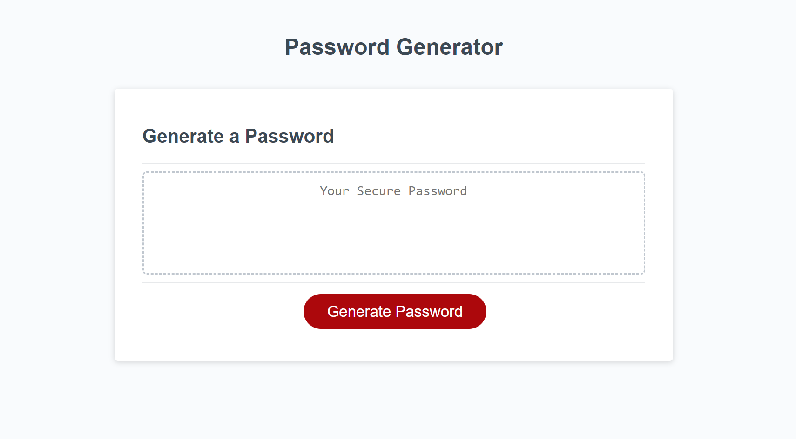

# Password-Generator

## Description

The password generator creates a password the way you would like it. You can choose to include, or not include, lower case letters, upper case letters, special characters, or numbers. You also need to choose the length of the password.

## Table of Contents

- [Installation](#installation)
- [Usage](#usage)
- [Credits](#credits)
- [License](#license)

## Installation

You can reach this webpage through any web browser. No installation is required.

## Usage

Click the button "Generate Password" and it will prompt you to fill in some criteria.

## Credits

- Rutgers University Coding Bootcamp
- [w3schools.com](W3schools.com)
- Fisher Yates (for the algorithm)

## License

N/A